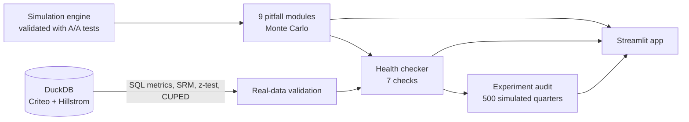

# A/B Pitfall Lab

**How A/B tests lie, measured.** A simulation lab and experiment health checker that shows, with Monte Carlo numbers, how nine common experimentation mistakes produce false wins, and how to detect and fix each one. Validated on two real randomized experiments (Criteo, 13.98M rows; Hillstrom, 64,000 rows) and shipped as an interactive Streamlit app.

📓 [Notebooks](notebooks/) · 📄 [Methodology](reports/methodology.md) · 📝 [Decision log](reports/decision_log.md) · 📋 [PM playbook](reports/experimentation_playbook.md) · 🧾 [Experiment audit](reports/experiment_audit.md) · 📋 [Project charter](reports/project_charter.md)

> **Live app:** _add the Streamlit Community Cloud link here after deploying (`app/Home.py`). The first visit after idle can take ~30 s to wake._

---

## TL;DR - key findings

1. **🔍 Peeking:** checking an A/A test daily for 14 days and stopping at the first p < 0.05 gives a **21.9% false positive rate instead of 5%**. O'Brien-Fleming boundaries hold it at 5.0% while keeping 74% power (vs 75% for a single look); mSPRT is always valid but needs about **2.0x the sample** for 80% power.
2. **⚖️ Sample ratio mismatch:** losing just 5% of low-engagement treatment users created a fake **2.9% lift** and a 13% false positive rate with a true effect of zero. A cheap SRM check fired in 100% of those tests.
3. **📉 Novelty:** a 3-day test of a change with *no* long-run effect reported a **16.6% lift** and was "significant" 50% of the time; the second week alone gave 2.3%.
4. **⚡ CUPED works only with a good covariate:** on real Criteo data, adjusting for the 12 features gives the same precision for the visit metric with **74% of the users** (26% fewer); on real Hillstrom data past spend barely predicts future spend (correlation 0.02), so CUPED removes only 0.04% of the variance.
5. **💰 The audit:** across **500 simulated quarters of 40 experiments (20,000 tests with known ground truth)**, a naive analyst shipped a median of 21 "wins" per quarter, of which **46% were false**. A rigorous analyst using the health checker shipped 11, with a **17%** false discovery rate.
6. **🔬 Real data is messier than textbooks:** in the full Criteo file the treated and control groups differ on pre-treatment features by up to 0.049 standard deviations (randomization would give about 0.0005), and adjusting for them moves the visit effect from +1.03 to +0.70 percentage points. Both estimates are reported, and the health checker has a Balance check for exactly this.

---

## The business problem

ShopKart, an Indian e-commerce app, runs about 40 A/B tests per quarter. The analysis habits are common: a plain t-test, daily check-ins, and shipping anything with p < 0.05 on any metric or segment. Leadership suspects many "wins" do not hold up. This project measures how bad each habit is, builds the checks that catch it, and counts what that is worth.

## Why simulation?

You can only measure a false positive rate when you **know the true answer**, and in a real experiment you never do. So the lab:

1. Simulates experiments with a known true effect (including zero) and switchable pitfalls.
2. **Validates the simulator before using it**: 2,000 A/A tests give a 4.7% false positive rate with flat p-values, and known effects are recovered with ~95% CI coverage ([notebook 01](notebooks/01_simulator_validation.ipynb)).
3. **Checks the methods on real randomized data**: Criteo (13,979,592 rows) and Hillstrom (64,000 rows). A/A on Criteo's real control group (1,000 random splits) gives 5.1% false positives on conversion and 4.8% on visits. The SQL and Python z-tests agree to the last digit.

## Architecture



## The nine pitfalls

Each follows the same template: **simulate → quantify → detect → fix → verify**. One notebook per pitfall in [`notebooks/`](notebooks/).

| # | Pitfall | Headline result |
|---|---|---|
| # | Pitfall | Headline result |
|---|---|---|
| 1 | Peeking | Checking daily for 14 days raised the false positive rate from 5% to 21.9%; O'Brien-Fleming held it at 5.0% and mSPRT at 0.2%, but mSPRT needed ~2.0x the sample for 80% power. |
| 2 | Winner's curse | At ~10% power, significant results overstated the true lift 4.1x; at 80% power the overstatement fell to 1.14x. |
| 3 | Sample ratio mismatch | Losing just 5% of low-engagement treatment users produced a fake 2.9% lift and a 13% false positive rate (true effect 0); the SRM check fired in 100% of those tests. |
| 4 | Novelty effect | A 3-day test of a change with zero long-run effect reported a 16.6% lift and was 'significant' 50% of the time; the daily-trend check flagged 41%, and using only week 2 cut the estimate to 2.3%. |
| 5 | Multiple metrics | Looking at 20 metrics gave a 54% chance of at least one false win with no real effect; Holm correction brought it back to 4.4%. |
| 6 | Segment p-hacking | Slicing into 15 segments after the fact produced a 'winning' segment in 54% of no-effect tests (average reported lift 36%); follow-up tests confirmed only 5.1%. |
| 7 | Heavy-tailed revenue | With 0.5% whale customers, a revenue test with a real +10% conversion lift had 5% power (plain t-test) vs 33% with pooled p99 winsorizing; false positive rates stayed near 5%. |
| 8 | Wrong unit of analysis | Analysing sessions instead of users raised the A/A false positive rate from 5% to 17% (users moderately different); the delta method held it at 5.1%. |
| 9 | Simpson's paradox in ramp-up | Ramping treatment up during a high-conversion sale made a no-effect change look 1.11 percentage points worse (false positive rate 100%); stratifying by day brought the estimate to 0.00 percentage points. |

Figures: [`reports/figures/`](reports/figures/). Full tables: [`data/results/`](data/results/).

## The health checker

`diagnose(df)` runs seven checks and returns a verdict: **SHIP**, **NO WIN**, **INVESTIGATE** (yellow) or **DON'T TRUST** (red).

| Check | Catches | Detection rate in its scenario | False alarm rate on clean tests |
|---|---|---|---|
| Sample ratio | Missing users | 100% | 0.0% |
| Power | Underpowered tests | 100% | 0.0% |
| Balance | Arms differ before treatment | 100% | 0.0% |
| Outliers | Whale-driven results | 68% | 0.0% |
| Novelty | Fading effects | 57% | 1.3% |
| Peeking, Multiple testing | Process flags (deterministic rules) | - | - |

Over 300 runs per scenario: the checker ships 99% of clean wins and 4% of clean nulls. **The novelty check is the weakest** (57% detection): the durable fix for novelty is procedural (run two full weeks), not statistical. The checker's own report card is in [`data/results/checker_report_card.csv`](data/results/checker_report_card.csv).

## The experiment audit

40 experiments per quarter, mixed from clean wins, clean nulls, underpowered wins, novelty-only effects, SRM bugs and noisy revenue, with the truth known for every one. Two analysts:

| | Naive analyst | Rigorous analyst |
|---|---|---|
| Looks | Daily; stops at first p < 0.05 | Fixed horizon |
| Metrics | Conversion, revenue, **or any of 5 segments** | One pre-registered primary metric |
| Checks | None | Health checker; ships only on a clean pass |

| Per quarter (median over 500 quarters) | Naive | Rigorous |
|---|---|---|
| "Wins" shipped | 21 | 11 |
| False wins | 9 | 2 |
| False discovery rate | 46% | 17% |
| True wins shipped / missed | 11.0 / 3.0 | 9.0 / 4.0 |
| Average reported vs true lift of shipped changes | 20.9% vs 6.0% | 12.1% vs 10.1% |
| Median total cost (illustrative) | ₹1.82 crore | ₹1.03 crore |

The rigorous process costs less in the base case (₹1.03 crore vs ₹1.82 crore), but that depends on assumptions. In the worst case for it (a flagged rerun is treated as an abandoned idea, so declining to ship underpowered true wins is a permanent loss) the rigorous analyst costs **more**: ₹2.78 crore vs ₹1.82 crore. See the sensitivity tables in the [audit report](reports/experiment_audit.md). **The false discovery rate and the overstated lifts do not depend on those assumptions.**

## Limitations

- **Simulated data is a model.** One outcome per user (not a daily panel); novelty decays with calendar day, not exposure time; treatment affects conversion only.
- **The audit's scenario mix and economics are assumptions**, not measurements. They are in [`config/audit_portfolio.yaml`](config/audit_portfolio.yaml) and re-run at different true-win shares.
- **No interference or network effects** (marketplaces, social products); those need cluster or switchback designs.
- **mSPRT's cost depends on the tuning parameter** tau, and is conservative with few looks.
- **Criteo's arms are imbalanced on pre-treatment features** in the public file; I report both raw and adjusted effects and do not assert the cause.
- The novelty check detects only part of the cases.

## Reproduce it

```bash
python -m venv .venv && .venv/Scripts/activate        # Windows; use source .venv/bin/activate elsewhere
pip install -r requirements.txt && pip install -e .
pytest -q                                              # unit tests incl. slow Monte Carlo validation
# Real data (not committed; ~311 MB): download Criteo's uplift CSV and Hillstrom into data/raw/ (see reports/decision_log.md)
python src/load/load_real.py && python scripts/real_data_validation.py
python scripts/run_pitfalls.py && python scripts/run_validation.py
python scripts/run_audit.py --workers 4                # ~35 min; each worker needs ~0.5 GB RAM
python scripts/build_notebooks.py && python scripts/build_readme.py
streamlit run app/Home.py
```

The app and notebooks read precomputed results from `data/results/`, so they work without the raw datasets.
