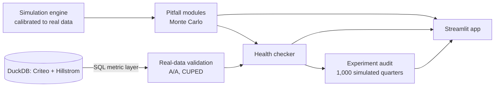

# A/B Pitfall Lab — Complete Project Roadmap

> **How A/B tests lie, measured.**
> A simulation lab and experiment health checker that shows, with numbers, how common experimentation mistakes produce false wins, and how to detect and fix each one. It's validated on real randomized experiment data and deployed as a live app.

**The business question:**
> *"ShopKart's product team ran 40 A/B tests last quarter and shipped 12 winners. How many of those wins were real, and what did the false ones cost?"*

| # | Component | Question it answers |
|---|---|---|
| Core | Statistics toolkit + simulation engine | *Can we generate experiments where we know the true answer?* |
| P1–P9 | Nine pitfall modules | *How much does each mistake distort results, and how do we catch it?* |
| CUPED | Variance reduction | *Can we get the same answer with fewer users or days?* |
| Checker | Experiment health checker | *Should we ship this test result? Yes, no, or rerun?* |
| Audit | Portfolio case study | *How many "wins" were false, and what did that cost?* |
| App | Streamlit, deployed | *Can a recruiter or PM play with this without Python?* |

**Total effort:** about 6 weeks at 15–20 hrs/week (about 100 hours).

---

## Table of Contents

0. [Before You Start: Principles](#0-before-you-start-principles)
1. [Phase 0 — Scoping & Setup (Days 1–3)](#phase-0--scoping--setup-days-13)
2. [Phase 1 — Core Statistics Toolkit (Week 1)](#phase-1--core-statistics-toolkit-week-1)
3. [Phase 2 — Simulation Engine (Week 1–2)](#phase-2--simulation-engine-week-12)
4. [Phase 3 — Real Data & SQL Layer (Week 2)](#phase-3--real-data--sql-layer-week-2)
5. [Phase 4 — The Pitfall Modules (Week 2–4)](#phase-4--the-pitfall-modules-week-24)
6. [Phase 5 — Variance Reduction with CUPED (Week 4)](#phase-5--variance-reduction-with-cuped-week-4)
7. [Phase 6 — Experiment Health Checker (Week 4–5)](#phase-6--experiment-health-checker-week-45)
8. [Phase 7 — Case Study: The Experiment Audit (Week 5)](#phase-7--case-study-the-experiment-audit-week-5)
9. [Phase 8 — Streamlit App & Deployment (Week 5–6)](#phase-8--streamlit-app--deployment-week-56)
10. [Phase 9 — Storytelling & Packaging (Week 6)](#phase-9--storytelling--packaging-week-6)
11. [Interview Preparation](#interview-preparation)
12. [Master Checklist](#master-checklist)
13. [Learning Resources](#learning-resources)
14. [Risks & Mitigations](#risks--mitigations)

---

## 0. Before You Start: Principles

1. **One template for every pitfall: Simulate → Quantify the damage → Detect → Fix → Verify the fix.** If a module skips a step, it isn't done.
2. **Every claim needs a Monte Carlo number.** Say *"Daily peeking over 14 days raised the false positive rate from 5.0% to X% across 10,000 simulated A/A tests,"* not *"peeking is bad."*
3. **The simulator must pass its own tests before you trust anything it says.** A/A tests must give about a 5% false positive rate, and known effects must be recovered with about 95% CI coverage. This is a hard gate before Phase 4.
4. **Simulation is a feature, not a shortcut.** You can only measure a false positive rate when you know the true answer, and in real data you never do. Calibrate to real data, and validate on real randomized data (Criteo, Hillstrom). Say this in the README.
5. **Write assumptions down as you make them.** Keep a running `reports/decision_log.md`. This becomes your interview material.
6. **Findings first, code second.** Every notebook ends with a "so what" sentence a PM would understand.
7. **Report your numbers, not the literature's.** The numbers in this roadmap are illustrations. Your README uses only what your own simulations produce.

---

## Phase 0 — Scoping & Setup (Days 1–3)

### 0.1 Define the fictional company scenario

**ShopKart**, an Indian e-commerce app, is testing a **new one-page checkout**.

| Metric type | Metric | Why it's included |
|---|---|---|
| Primary | Conversion rate (user converted: yes/no) | Binary metric; the classic z-test |
| Secondary | Revenue per user (₹) | Heavy-tailed; shows the outlier and CUPED pitfalls |
| Secondary | Average order value | Ratio metric; shows the delta method |
| Secondary | Clicks per session | Shows the unit-of-analysis pitfall |
| Guardrail | Page load time, refund rate | Shows you think about harm, not just wins |

**Unit of randomization:** user. **Default allocation:** 50/50. **Default duration:** 14 days (two full weekly cycles).

### 0.2 Write a one-page project charter (`reports/project_charter.md`)

```markdown
# A/B Pitfall Lab — Project Charter

## Problem
ShopKart runs ~40 A/B tests per quarter. Analysts use a plain t-test, check results
daily, and ship anything with p < 0.05 on any metric or segment. Leadership suspects
many "wins" don't hold up after launch, but no one knows how many.

## Stakeholders (personas)
- Head of Product: wants to know how many shipped wins were real
- Growth PM: wants faster tests without being wrong more often
- Analytics Lead: wants a standard checklist before any result is shared

## Key Questions
1. How much does each common mistake (peeking, SRM, novelty, multiple testing, etc.)
   inflate false positives or bias effect estimates?
2. Which detection checks catch each mistake, and how reliably?
3. How much can variance reduction (CUPED) shorten tests?
4. Applied to a realistic portfolio of 40 tests, how many naive "wins" were false,
   and what did that cost?

## Success Criteria
- Simulator passes A/A (FPR 5% ± 1%) and known-effect (95% ± 2% CI coverage) tests
- Every pitfall module reports a Monte Carlo headline number + a verified fix
- Methods validated on at least one real randomized dataset (Criteo or Hillstrom)
- Deliverables: live Streamlit app, experimentation playbook, audit report, README

## Out of Scope
Bandits, interference/network effects (mentioned as limitation), Bayesian A/B testing
(optional stretch), real company data.
```

### 0.3 Environment setup (Windows)

**Install:** Python 3.11 or 3.12, Git, VS Code, and optionally DBeaver (a SQL GUI for DuckDB).

```powershell
cd D:\projects\ab-pitfall-lab
git init
python -m venv .venv
.\.venv\Scripts\Activate.ps1
python -m pip install --upgrade pip
```

`requirements.txt`:
```text
numpy
scipy
statsmodels
pandas
pyarrow
duckdb
plotly
matplotlib
streamlit
pyyaml
tqdm
pytest
jupyter
scikit-uplift     # optional: convenient downloaders for Criteo / Hillstrom
```

`pyproject.toml` (makes `src/abtest` importable everywhere with `pip install -e .`):
```toml
[project]
name = "abtest"
version = "0.1.0"
requires-python = ">=3.11"

[build-system]
requires = ["setuptools>=68"]
build-backend = "setuptools.build_meta"

[tool.setuptools.packages.find]
where = ["src"]

[tool.pytest.ini_options]
markers = ["slow: long Monte Carlo tests (deselect with -m 'not slow')"]
```

```powershell
pip install -r requirements.txt
pip install -e .
```

> **If `scikit-uplift` fails to install** on your Python version, skip it. You can download the datasets directly (see Phase 3).

### 0.4 Repository structure

```text
ab-pitfall-lab/  (D:\projects\ab-pitfall-lab)
├── README.md                      # the recruiter-facing story (Phase 9)
├── ROADMAP.md                     # this file
├── requirements.txt
├── pyproject.toml
├── .gitignore                     # .venv/, data/raw/, data/warehouse/, *.duckdb, .ipynb_checkpoints/
├── .github/workflows/tests.yml    # CI (Phase 1)
├── config/
│   ├── scenario.yaml              # ShopKart defaults
│   └── audit_portfolio.yaml       # scenario mix for the audit (Phase 7)
├── data/
│   ├── raw/                       # Criteo / Hillstrom downloads (gitignored)
│   ├── warehouse/lab.duckdb       # (gitignored)
│   ├── results/                   # Monte Carlo outputs as parquet (COMMIT small ones)
│   └── exports/                   # CSVs for the app / optional BI dashboard
├── src/abtest/
│   ├── __init__.py
│   ├── analyze/{tests.py, power.py, sequential.py, cuped.py}
│   ├── simulate/{engine.py, fast.py}
│   ├── pitfalls/{peeking.py, winners_curse.py, srm.py, novelty.py, multiple_testing.py,
│   │             segments.py, heavy_tails.py, unit_of_analysis.py, simpson.py}
│   ├── diagnose/checker.py
│   └── audit/portfolio.py
├── src/load/load_real.py
├── sql/{metrics_by_arm.sql, srm_check.sql, ztest.sql, cuped.sql, aa_split.sql}
├── tests/{test_stats.py, test_power.py, test_simulator.py, test_sequential.py, test_checker.py}
├── notebooks/
│   ├── 00_stats_toolkit.ipynb
│   ├── 01_simulator_validation.ipynb
│   ├── 02_real_data.ipynb
│   ├── 10_peeking.ipynb … 18_simpson.ipynb   # one per pitfall
│   ├── 20_cuped.ipynb
│   └── 30_audit.ipynb
├── app/
│   ├── Home.py
│   └── pages/{1_Pitfall_Playground.py, 2_Power_Calculator.py, 3_Health_Checker.py, 4_Audit.py}
└── reports/
    ├── project_charter.md
    ├── decision_log.md
    ├── methodology.md
    ├── pitfall_summary.md
    ├── experiment_audit.md
    ├── experimentation_playbook.md
    └── figures/
```

### 0.5 Start the decision log (`reports/decision_log.md`)

```markdown
# Decision Log

## 2026-10-XX — Scenario and defaults
- Chose e-commerce checkout: it gives binary, heavy-tailed, and ratio metrics in one scenario.
- 14-day default duration: two full weekly cycles, so the day-of-week effect cancels out.
- alpha = 0.05 two-sided, power = 0.80: industry-standard defaults; revisit in playbook.

## 2026-10-XX — SRM threshold
- Flag SRM at p < 0.001, not 0.05: SRM checks run on every experiment, so a strict
  threshold keeps false alarms rare (following Fabijan et al. 2019).
```

### ✅ Phase 0 done when
- [ ] Scenario and metrics defined
- [ ] Project charter written
- [ ] Repo, venv, `pyproject.toml` and folder structure created; first commit pushed to GitHub
- [ ] `decision_log.md` started
- [ ] Read Kohavi et al., chapters 2, 3 and 17 (see resources)

---

## Phase 1 — Core Statistics Toolkit (Week 1)

Every later phase relies on these functions, so they must be correct and tested.

### 1.1 Hypothesis tests (`src/abtest/analyze/tests.py`)

```python
from dataclasses import dataclass

import numpy as np
from scipy import stats


@dataclass
class TestResult:
    effect: float          # treatment - control (absolute)
    se: float
    p_value: float
    ci_low: float
    ci_high: float
    rel_lift: float        # effect / control mean

    @property
    def significant(self) -> bool:
        return self.p_value < 0.05


def two_prop_ztest(conv_a: int, n_a: int, conv_b: int, n_b: int, alpha: float = 0.05) -> TestResult:
    """Pooled SE for the test (matches statsmodels), unpooled SE for the CI."""
    p_a, p_b = conv_a / n_a, conv_b / n_b
    p_pool = (conv_a + conv_b) / (n_a + n_b)
    se_pool = np.sqrt(p_pool * (1 - p_pool) * (1 / n_a + 1 / n_b))
    diff = p_b - p_a
    z = diff / se_pool
    p = 2 * stats.norm.sf(abs(z))
    se_ci = np.sqrt(p_a * (1 - p_a) / n_a + p_b * (1 - p_b) / n_b)
    h = stats.norm.ppf(1 - alpha / 2) * se_ci
    return TestResult(diff, se_ci, p, diff - h, diff + h, diff / p_a)


def welch_ttest(a, b, alpha: float = 0.05) -> TestResult:
    a, b = np.asarray(a, float), np.asarray(b, float)
    va, vb = a.var(ddof=1) / len(a), b.var(ddof=1) / len(b)
    se = np.sqrt(va + vb)
    dof = (va + vb) ** 2 / (va**2 / (len(a) - 1) + vb**2 / (len(b) - 1))
    diff = b.mean() - a.mean()
    p = 2 * stats.t.sf(abs(diff / se), dof)
    h = stats.t.ppf(1 - alpha / 2, dof) * se
    return TestResult(diff, se, p, diff - h, diff + h, diff / a.mean())


def bootstrap_diff_ci(a, b, n_boot: int = 2000, alpha: float = 0.05, seed=None):
    """Percentile bootstrap CI for difference in means. Use for heavy-tailed metrics."""
    rng = np.random.default_rng(seed)
    a, b = np.asarray(a, float), np.asarray(b, float)
    diffs = np.empty(n_boot)
    for i in range(n_boot):
        diffs[i] = rng.choice(b, len(b)).mean() - rng.choice(a, len(a)).mean()
    return tuple(np.quantile(diffs, [alpha / 2, 1 - alpha / 2]))


def _ratio_and_var(num, den):
    """Delta-method variance of sum(num)/sum(den), with one row per randomization unit."""
    n = len(num)
    mx, my = den.mean(), num.mean()
    vx, vy = den.var(ddof=1), num.var(ddof=1)
    cxy = np.cov(num, den, ddof=1)[0, 1]
    r = my / mx
    var_r = (vy / mx**2 - 2 * my * cxy / mx**3 + my**2 * vx / mx**4) / n
    return r, var_r


def delta_method_ratio(num_a, den_a, num_b, den_b, alpha: float = 0.05) -> TestResult:
    """Ratio metrics (AOV = revenue/orders, CTR = clicks/sessions) randomized by user."""
    r_a, v_a = _ratio_and_var(np.asarray(num_a, float), np.asarray(den_a, float))
    r_b, v_b = _ratio_and_var(np.asarray(num_b, float), np.asarray(den_b, float))
    diff, se = r_b - r_a, np.sqrt(v_a + v_b)
    p = 2 * stats.norm.sf(abs(diff / se))
    h = stats.norm.ppf(1 - alpha / 2) * se
    return TestResult(diff, se, p, diff - h, diff + h, diff / r_a)


def srm_test(n_a: int, n_b: int, expected_share_b: float = 0.5) -> float:
    """Chi-square goodness-of-fit p-value for the observed split. Flag if p < 0.001."""
    total = n_a + n_b
    expected = [total * (1 - expected_share_b), total * expected_share_b]
    return stats.chisquare([n_a, n_b], f_exp=expected).pvalue
```

### 1.2 Power and MDE (`src/abtest/analyze/power.py`)

```python
import numpy as np
from scipy import stats


def sample_size_proportions(p_base: float, mde_rel: float, alpha=0.05, power=0.8) -> int:
    """Users needed PER ARM to detect a relative lift of mde_rel on a conversion rate."""
    p1, p2 = p_base, p_base * (1 + mde_rel)
    z_a, z_b = stats.norm.ppf(1 - alpha / 2), stats.norm.ppf(power)
    var = p1 * (1 - p1) + p2 * (1 - p2)
    return int(np.ceil((z_a + z_b) ** 2 * var / (p2 - p1) ** 2))


def mde_proportions(p_base: float, n_per_arm: int, alpha=0.05, power=0.8) -> float:
    """Smallest RELATIVE lift detectable with n_per_arm users (normal approximation)."""
    z_a, z_b = stats.norm.ppf(1 - alpha / 2), stats.norm.ppf(power)
    abs_mde = (z_a + z_b) * np.sqrt(2 * p_base * (1 - p_base) / n_per_arm)
    return abs_mde / p_base


def sample_size_means(sd: float, mde_abs: float, alpha=0.05, power=0.8) -> int:
    z_a, z_b = stats.norm.ppf(1 - alpha / 2), stats.norm.ppf(power)
    return int(np.ceil(2 * (z_a + z_b) ** 2 * sd**2 / mde_abs**2))


def days_needed(n_per_arm: int, users_per_day: int, treat_share=0.5) -> int:
    return int(np.ceil(n_per_arm / (users_per_day * min(treat_share, 1 - treat_share))))
```

### 1.3 Tests (`tests/test_stats.py`, `tests/test_power.py`)

```python
import numpy as np
from statsmodels.stats.proportion import proportions_ztest, proportion_effectsize
from statsmodels.stats.power import NormalIndPower
from scipy import stats

from abtest.analyze.tests import two_prop_ztest, welch_ttest, srm_test
from abtest.analyze.power import sample_size_proportions


def test_ztest_matches_statsmodels():
    r = two_prop_ztest(500, 10_000, 560, 10_000)
    _, p_sm = proportions_ztest([560, 500], [10_000, 10_000])
    assert abs(r.p_value - p_sm) < 1e-10


def test_welch_matches_scipy():
    rng = np.random.default_rng(0)
    a, b = rng.normal(10, 3, 500), rng.normal(10.5, 5, 800)
    r = welch_ttest(a, b)
    assert abs(r.p_value - stats.ttest_ind(b, a, equal_var=False).pvalue) < 1e-10


def test_srm_flags_obvious_imbalance():
    assert srm_test(50_000, 50_000) > 0.5
    assert srm_test(50_000, 48_500) < 0.001


def test_sample_size_close_to_statsmodels():
    ours = sample_size_proportions(0.05, 0.10)
    h = proportion_effectsize(0.055, 0.05)          # Cohen's h (arcsine); slightly different formula
    theirs = NormalIndPower().solve_power(h, alpha=0.05, power=0.8, ratio=1)
    assert abs(ours - theirs) / theirs < 0.03
```

### 1.4 Continuous integration (`.github/workflows/tests.yml`)

```yaml
name: tests
on: [push, pull_request]
jobs:
  test:
    runs-on: ubuntu-latest
    steps:
      - uses: actions/checkout@v4
      - uses: actions/setup-python@v5
        with:
          python-version: "3.12"
      - run: pip install -r requirements.txt && pip install -e .
      - run: pytest -q -m "not slow"
```

Add the green "tests passing" badge to your README. It's a small detail that signals engineering discipline.

### ✅ Phase 1 done when
- [ ] All toolkit functions written, with docstrings
- [ ] Tests match scipy and statsmodels; CI is green on GitHub
- [ ] `00_stats_toolkit.ipynb` explains each test in plain language, including when to use it

---

## Phase 2 — Simulation Engine (Week 1–2)

Two simulators:
- **`engine.py`**: user-level rows (realistic, needed for CUPED, segments, revenue, SRM)
- **`fast.py`**: aggregate daily counts (100× faster, used for 10,000+ run Monte Carlo on conversion)

> **Decision log entry:** *"Monte Carlo on binary metrics uses binomial counts per arm per day instead of user rows. Counts are sufficient statistics for the z-test, so results are identical and runs are about 100× faster."*

### 2.1 User-level engine (`src/abtest/simulate/engine.py`)

```python
from dataclasses import dataclass
from functools import lru_cache

import numpy as np
import pandas as pd
from scipy.optimize import brentq
from scipy.special import expit, logit


@dataclass
class ExperimentConfig:
    days: int = 14
    users_per_day: int = 4_000
    treat_share: float = 0.5
    base_cr: float = 0.05             # control conversion rate
    lift: float = 0.0                 # TRUE long-run relative lift on conversion
    novelty_boost: float = 0.0        # extra relative lift on day 0 that decays away
    novelty_halflife: float = 3.0     # days
    engagement_beta: float = 0.8      # how strongly latent engagement drives conversion
    rev_mu: float = 6.5               # log-normal order value: exp(6.5) ≈ ₹665 median
    rev_sigma: float = 1.0
    pre_corr: float = 0.6             # corr(engagement now, engagement in pre-period)
    whale_rate: float = 0.0           # share of converters who are whales
    whale_multiplier: float = 50.0
    srm_drop_rate: float = 0.0        # share of treatment users lost (low-engagement ones)
    ramp_days: int = 0                # days at reduced treatment share (Simpson's paradox)
    ramp_treat_share: float = 0.1
    n_segments: int = 5
    seed: int | None = None


@lru_cache(maxsize=256)
def _intercept(base_cr: float, beta: float) -> float:
    """Pick the logit intercept so that the AVERAGE conversion rate equals base_cr."""
    z = np.random.default_rng(12345).standard_normal(200_000)
    return brentq(lambda a: expit(a + beta * z).mean() - base_cr, -20, 10)


def simulate(cfg: ExperimentConfig) -> pd.DataFrame:
    rng = np.random.default_rng(cfg.seed)
    n = cfg.days * cfg.users_per_day
    day = np.repeat(np.arange(cfg.days), cfg.users_per_day)

    share = np.where(day < cfg.ramp_days, cfg.ramp_treat_share, cfg.treat_share)
    treat = rng.random(n) < share

    u = rng.standard_normal(n)                                   # latent engagement
    pre_latent = cfg.pre_corr * u + np.sqrt(1 - cfg.pre_corr**2) * rng.standard_normal(n)
    pre_spend = np.exp(cfg.rev_mu + cfg.rev_sigma * pre_latent)   # CUPED covariate

    lift_t = cfg.lift + cfg.novelty_boost * 0.5 ** (day / cfg.novelty_halflife)
    p0 = expit(_intercept(cfg.base_cr, cfg.engagement_beta) + cfg.engagement_beta * u)
    p = np.clip(p0 * (1 + treat * lift_t), 0, 1)
    converted = rng.random(n) < p

    order_latent = 0.5 * u + np.sqrt(0.75) * rng.standard_normal(n)
    revenue = np.where(converted, np.exp(cfg.rev_mu + cfg.rev_sigma * order_latent), 0.0)
    whale = converted & (rng.random(n) < cfg.whale_rate)
    revenue = np.where(whale, revenue * cfg.whale_multiplier, revenue)

    df = pd.DataFrame({
        "user_id": np.arange(n),
        "day": day,
        "arm": np.where(treat, "treatment", "control"),
        "segment": rng.integers(0, cfg.n_segments, n),
        "pre_spend": pre_spend,
        "converted": converted.astype(int),
        "revenue": revenue,
    })

    # SRM bug: the new page loses some LOW-engagement treatment users before logging.
    if cfg.srm_drop_rate > 0:
        lost = treat & (u < 0) & (rng.random(n) < 2 * cfg.srm_drop_rate)
        df = df[~lost].reset_index(drop=True)
    return df
```

**Simplifications to record in the decision log:**
- Each user has one outcome, not a daily panel. Novelty is modelled as an effect that decays with calendar day since launch.
- The treatment affects conversion only. Order value is unchanged, so revenue lift comes from conversion.
- SRM is modelled as losing low-engagement treatment users, which biases treatment upward. This is the dangerous direction.

### 2.2 Fast aggregate simulator (`src/abtest/simulate/fast.py`)

```python
import numpy as np


def daily_counts(rng, n_sims: int, days: int, n_per_arm_day: int, p_a, p_b):
    """Binomial conversions per arm per day. p_b may be an array of length `days` (novelty).
    Returns cumulative conversions and cumulative users, shape (n_sims, days)."""
    p_b = np.broadcast_to(p_b, (days,))
    conv_a = rng.binomial(n_per_arm_day, p_a, size=(n_sims, days)).cumsum(axis=1)
    conv_b = rng.binomial(n_per_arm_day, p_b, size=(n_sims, days)).cumsum(axis=1)
    n = n_per_arm_day * np.arange(1, days + 1)
    return conv_a, conv_b, n


def ztest_vectorized(conv_a, conv_b, n):
    """Pooled two-proportion z statistic, elementwise. n is users per arm."""
    p_a, p_b = conv_a / n, conv_b / n
    pool = (conv_a + conv_b) / (2 * n)
    se = np.sqrt(np.maximum(pool * (1 - pool) * 2 / n, 1e-12))
    return (p_b - p_a) / se
```

### 2.3 Calibrate to real data
Set `base_cr`, `rev_mu` and `rev_sigma` from real data:
- **Conversion rate:** Hillstrom's control group conversion rate, or Criteo's control conversion rate (Phase 3).
- **Order value distribution:** fit a log-normal to non-zero `spend` in Hillstrom (`np.log(spend).mean()`, `.std()`).

Record the fitted numbers in the decision log. This lets you say in an interview that the simulator is calibrated to real e-commerce data.

### 2.4 Validation: the hard gate (`tests/test_simulator.py`)

```python
import numpy as np
import pytest

from abtest.analyze.tests import two_prop_ztest
from abtest.simulate.engine import ExperimentConfig, simulate


def _ztest(df):
    g = df.groupby("arm")["converted"].agg(["sum", "count"])
    return two_prop_ztest(g.loc["control", "sum"], g.loc["control", "count"],
                          g.loc["treatment", "sum"], g.loc["treatment", "count"])


@pytest.mark.slow
def test_aa_false_positive_rate_is_5pct():
    rejections = sum(
        _ztest(simulate(ExperimentConfig(days=7, users_per_day=2_000, seed=s))).significant
        for s in range(1_000)
    )
    assert 0.035 < rejections / 1_000 < 0.065        # 95% band for 1,000 runs


@pytest.mark.slow
def test_known_effect_recovered_with_correct_coverage():
    base, lift = 0.05, 0.10
    true_abs = base * lift
    estimates, covered = [], 0
    for s in range(1_000):
        r = _ztest(simulate(ExperimentConfig(days=7, users_per_day=4_000, lift=lift, seed=s)))
        estimates.append(r.effect)
        covered += r.ci_low <= true_abs <= r.ci_high
    assert abs(np.mean(estimates) - true_abs) < 0.1 * true_abs
    assert 0.93 < covered / 1_000 < 0.97


def test_srm_injection_changes_split():
    df = simulate(ExperimentConfig(days=7, srm_drop_rate=0.05, seed=0))
    share_t = (df["arm"] == "treatment").mean()
    assert share_t < 0.49
```

Run the slow tests locally with `pytest -m slow`. CI runs only the fast ones.

**Also chart in `01_simulator_validation.ipynb`:**
- A/A p-value histogram, which should be flat (uniform)
- Rolling false positive rate as simulations accumulate
- Estimate vs. true effect across a range of lifts

A flat A/A p-value histogram is one of the most convincing charts in the project. Put it in the README.

### ✅ Phase 2 done when
- [ ] Both simulators written
- [ ] Parameters calibrated to real data and logged
- [ ] **A/A false positive rate is 5% ± 1.5%, CI coverage is 95% ± 2%, and the p-value histogram is flat**
- [ ] Simplifications recorded in the decision log

---

## Phase 3 — Real Data & SQL Layer (Week 2)

### 3.1 Datasets

| Dataset | What it is | Use it for |
|---|---|---|
| **Criteo Uplift** | Real randomized ad experiment, about 13–14M rows: `treatment`, `visit`, `conversion`, `exposure`, and 12 anonymized pre-treatment features `f0–f11` | Scale, SQL layer, A/A on real data, SRM with an unequal split, regression adjustment |
| **Hillstrom (MineThatData)** | 64,000 customers randomized into Men's email / Women's email / No email; outcomes `visit`, `conversion`, `spend`; pre-period `history` (past-year spend) | Calibration, and a textbook CUPED demo using `history` as the pre-period covariate |

**How to get them:**
- With scikit-uplift: `from sklift.datasets import fetch_criteo, fetch_hillstrom`. Check the current function signatures in the sklift docs. Criteo has a `percent10` option for a smaller download.
- Without it: download the CSVs from the Criteo AI Lab page and the MineThatData blog, and save them to `data/raw/`.

> **Before relying on either:** check the licence (Criteo is released for research use) and the **documented treatment ratio**. Criteo's split is intentionally **not 50/50**, so your SRM check must use the expected ratio. Record both in the decision log.

### 3.2 Load into DuckDB (`src/load/load_real.py`)

```python
import duckdb

con = duckdb.connect("data/warehouse/lab.duckdb")
con.execute("CREATE SCHEMA IF NOT EXISTS raw")

con.execute("""
    CREATE OR REPLACE TABLE raw.criteo AS
    SELECT row_number() OVER () AS user_id, *
    FROM read_csv_auto('data/raw/criteo-uplift-v2.1.csv.gz')
""")
con.execute("""
    CREATE OR REPLACE TABLE raw.hillstrom AS
    SELECT row_number() OVER () AS user_id, *
    FROM read_csv_auto('data/raw/hillstrom.csv')
""")
for t in ["criteo", "hillstrom"]:
    print(t, con.execute(f"SELECT count(*) FROM raw.{t}").fetchone()[0])
```

> Match the file names to what you actually downloaded. Criteo's full CSV is a few GB, so start with the 10% sample while you build.

### 3.3 SQL metric layer (`sql/`)

**`metrics_by_arm.sql`:**
```sql
SELECT
    treatment                                  AS arm,
    count(*)                                   AS users,
    avg(visit)                                 AS visit_rate,
    avg(conversion)                            AS conversion_rate,
    var_samp(conversion)                       AS conversion_var
FROM raw.criteo
GROUP BY treatment
ORDER BY arm;
```

**`srm_check.sql`:** chi-square computed in SQL. 10.828 is the critical value for p = 0.001 with df = 1.
```sql
-- Set :expected_treat_share to the documented split (e.g. 0.85), NOT 0.5.
WITH counts AS (
    SELECT sum(treatment)::DOUBLE AS n_t, sum(1 - treatment)::DOUBLE AS n_c, count(*)::DOUBLE AS n
    FROM raw.criteo
),
chi AS (
    SELECT n_t, n_c,
           power(n_t - n * $expected_treat_share, 2) / (n * $expected_treat_share)
         + power(n_c - n * (1 - $expected_treat_share), 2) / (n * (1 - $expected_treat_share)) AS chi2
    FROM counts
)
SELECT n_t, n_c, n_t / (n_t + n_c) AS observed_share, chi2,
       chi2 > 10.828 AS srm_flag
FROM chi;
```

**`ztest.sql`:** a complete two-proportion z-test in SQL.
```sql
WITH a AS (
    SELECT
        sum(CASE WHEN treatment = 0 THEN conversion END)::DOUBLE AS conv_c,
        sum(CASE WHEN treatment = 0 THEN 1 END)::DOUBLE          AS n_c,
        sum(CASE WHEN treatment = 1 THEN conversion END)::DOUBLE AS conv_t,
        sum(CASE WHEN treatment = 1 THEN 1 END)::DOUBLE          AS n_t
    FROM raw.criteo
),
b AS (
    SELECT *, conv_c / n_c AS p_c, conv_t / n_t AS p_t,
           (conv_c + conv_t) / (n_c + n_t) AS p_pool
    FROM a
)
SELECT p_c, p_t, p_t - p_c AS diff, (p_t - p_c) / p_c AS rel_lift,
       (p_t - p_c) / sqrt(p_pool * (1 - p_pool) * (1 / n_c + 1 / n_t)) AS z,
       abs((p_t - p_c) / sqrt(p_pool * (1 - p_pool) * (1 / n_c + 1 / n_t))) > 1.96 AS significant
FROM b;
```

**`cuped.sql`:** Hillstrom, spend adjusted by pre-period `history`.
```sql
WITH exp AS (
    SELECT user_id, segment AS arm, spend AS y, history AS x
    FROM raw.hillstrom
    WHERE segment IN ('No E-Mail', 'Womens E-Mail')
),
theta AS (
    SELECT covar_samp(y, x) / var_samp(x) AS theta, avg(x) AS x_bar FROM exp
)
SELECT
    arm,
    count(*)                                   AS users,
    avg(y)                                     AS mean_raw,
    var_samp(y)                                AS var_raw,
    avg(y - theta * (x - x_bar))               AS mean_cuped,
    var_samp(y - theta * (x - x_bar))          AS var_cuped,
    1 - var_samp(y - theta * (x - x_bar)) / var_samp(y) AS variance_reduction
FROM exp, theta
GROUP BY arm;
```

### 3.4 A/A test on real data
Take **Criteo's control group only**, split it randomly 50/50 500–1,000 times, and run the z-test each time. The false positive rate should be about 5%. This proves your pipeline behaves correctly on real data, not just your simulator's.

```python
import duckdb
import numpy as np
from abtest.simulate.fast import ztest_vectorized

con = duckdb.connect("data/warehouse/lab.duckdb", read_only=True)
y = con.execute("SELECT conversion FROM raw.criteo WHERE treatment = 0").fetchnumpy()["conversion"]

rng = np.random.default_rng(0)
z = []
for _ in range(500):
    mask = rng.random(len(y)) < 0.5
    ca, cb = y[~mask].sum(), y[mask].sum()
    na, nb = (~mask).sum(), mask.sum()
    pa, pb, pool = ca / na, cb / nb, (ca + cb) / (na + nb)
    z.append((pb - pa) / np.sqrt(pool * (1 - pool) * (1 / na + 1 / nb)))
print("A/A FPR on real data:", np.mean(np.abs(z) > 1.96))
```

### 3.5 The real treatment effect
Run the proper analysis on Criteo treatment vs. control for `visit` and `conversion`, with CIs, in both Python and SQL. **The two must match.** Note in the notebook that conversion is rare, so its CI is wide. This leads naturally into Phase 5 (CUPED).

### ✅ Phase 3 done when
- [ ] Both datasets loaded into DuckDB; row counts and treatment split recorded
- [ ] SQL metrics, SRM check, z-test and CUPED queries work; Python and SQL results match
- [ ] A/A false positive rate on real Criteo data is about 5%
- [ ] Simulator re-calibrated with the real parameters (Phase 2.3)

---

## Phase 4 — The Pitfall Modules (Week 2–4)

This is the core of the project: **one module and one notebook per pitfall**, each following the same five-step template. Each ends with **one headline sentence** that goes into `reports/pitfall_summary.md`.

**Notebook template:**
```markdown
# P1 — Peeking
## 1. What goes wrong (2–3 sentences, PM-friendly)
## 2. Simulate        — config used, number of runs
## 3. Quantify damage — the headline chart + number
## 4. Detect          — how you'd spot this in a real experiment
## 5. Fix             — the method
## 6. Verify fix      — Monte Carlo showing the fix restores validity; what it costs
## So what            — one sentence for the README
```

**Suggested order:** P1 → P3 → P2 → P5 → P4 → P7 → P8 → P6 → P9. The most impressive ones come first, in case you run short on time.

---

### P1 — Peeking / optional stopping (`pitfalls/peeking.py`, `analyze/sequential.py`)

**What goes wrong:** the analyst checks the p-value every day and stops as soon as p < 0.05. Each look is another chance for noise to cross the line.

**Quantify:**
```python
import numpy as np
from scipy import stats
from abtest.simulate.fast import daily_counts, ztest_vectorized


def peeking_fpr(n_sims=10_000, days=14, users_per_day=4_000, p=0.05, alpha=0.05, seed=0):
    rng = np.random.default_rng(seed)
    ca, cb, n = daily_counts(rng, n_sims, days, users_per_day // 2, p, p)   # A/A: no effect
    sig = np.abs(ztest_vectorized(ca, cb, n)) > stats.norm.ppf(1 - alpha / 2)
    return {
        "fixed_horizon_fpr": sig[:, -1].mean(),     # look once, at the end
        "daily_peeking_fpr": sig.any(axis=1).mean(),  # stop at first p < 0.05
    }
```
**Headline chart:** false positive rate vs. number of peeks (1, 2, 5, 7, 14, 28 looks; for 28, simulate twice-daily looks).

**Fix 1: group sequential with O'Brien-Fleming boundaries.** Plan K looks in advance, and use strict thresholds early and nearly 1.96 at the end. Calibrate the constant by simulation instead of looking it up:

```python
def calibrate_obf(n_looks: int, alpha=0.05, n_sims=200_000, seed=0) -> float:
    """Reject at look k if |z_k| > c * sqrt(K / k). Find c so overall FPR = alpha."""
    rng = np.random.default_rng(seed)
    k = np.arange(1, n_looks + 1)
    z = rng.standard_normal((n_sims, n_looks)).cumsum(axis=1) / np.sqrt(k)
    stat = np.max(np.abs(z) / np.sqrt(n_looks / k), axis=1)
    return float(np.quantile(stat, 1 - alpha))


def obf_boundaries(n_looks: int, c: float):
    k = np.arange(1, n_looks + 1)
    return c * np.sqrt(n_looks / k)
```
> **Sanity check:** for 5 equally spaced looks at α = 0.05, `c` should come out close to the published O'Brien-Fleming constant (about 2.04). If it doesn't, you have a bug.

**Fix 2: mSPRT always-valid p-values** (Johari et al.). You can look at any time, as often as you like:

```python
def msprt_pvalues(conv_a, conv_b, n_a, n_b, tau2: float):
    """Normal-mixture SPRT on the difference in proportions.
    Inputs are cumulative arrays over looks (last axis = time)."""
    pa, pb = conv_a / n_a, conv_b / n_b
    theta = pb - pa
    V = np.maximum(pa * (1 - pa) / n_a + pb * (1 - pb) / n_b, 1e-12)
    lam = np.sqrt(V / (V + tau2)) * np.exp(tau2 * theta**2 / (2 * V * (V + tau2)))
    return np.minimum.accumulate(np.minimum(1.0, 1.0 / lam), axis=-1)
```
> `tau2` is a tuning choice: roughly (the effect size you expect)². For a 5% baseline and a 5% relative lift, try `tau2 = (0.05 * 0.05) ** 2`. Record the choice, and show sensitivity to it.

**Verify:** A/A false positive rate ≤ 5% for both fixes. Then show **the cost**: power at the same sample size, and average days to decision when a real effect exists. Sequential methods often stop early on big effects, which is a nice business point.

**Headline:** *"Peeking daily for 14 days raised the false positive rate from 5% to X%. O'Brien-Fleming (5 planned looks) and mSPRT (unlimited looks) both kept it at or below 5%. mSPRT needed Y% more users for the same power but stopped Z days early when the effect was large."*

---

### P2 — Underpowered tests and the winner's curse (`pitfalls/winners_curse.py`)

**What goes wrong:** with low power, the only way to reach significance is to overestimate the effect by luck. So **significant results from small tests are systematically exaggerated**, and sometimes have the wrong sign.

```python
def winners_curse(true_rel_lift=0.02, p=0.05, n_per_arm=10_000, n_sims=20_000, seed=0):
    rng = np.random.default_rng(seed)
    ca = rng.binomial(n_per_arm, p, n_sims)
    cb = rng.binomial(n_per_arm, p * (1 + true_rel_lift), n_sims)
    z = ztest_vectorized(ca, cb, n_per_arm)
    est = (cb - ca) / ca                       # estimated relative lift
    sig = np.abs(z) > 1.96
    return {
        "power": sig.mean(),
        "exaggeration_ratio": np.abs(est[sig]).mean() / true_rel_lift,   # Type M
        "wrong_sign_share": (est[sig] < 0).mean(),                       # Type S
    }
```
**Headline chart:** exaggeration ratio vs. power, for 10% to 90% power.

**Fix:** power analysis *before* launch, using your `power.py`, with a stated MDE. Show that at 80% power the exaggeration is small.

**Headline:** *"At 20% power, significant results overstated the true lift by X× on average, and Y% had the wrong sign. At 80% power the exaggeration fell to Z×."*

---

### P3 — Sample ratio mismatch (`pitfalls/srm.py`)

**What goes wrong:** the split is supposed to be 50/50 but isn't, e.g. because the new page crashes on slow phones and those users never get logged. The groups are no longer comparable, so **every number from the test is biased**, often in the treatment's favour.

**Quantify:** run `simulate()` with `lift=0` and `srm_drop_rate` from 0 to 5%. For each, record:
- the false positive rate, which should rise well above 5%
- the average estimated "lift", which is bias, since the true lift is 0
- the observed treatment share

**Detect:** `srm_test()` at p < 0.001. Measure **detection power**: at what drop rate and sample size does the check reliably fire?

**Fix:** there's no statistical fix. **The fix is to not trust the result, find the root cause and rerun.** List real causes in the notebook: bots, redirects, crashes, logging bugs, and assignment happening after a filter (Fabijan et al. 2019 is the reference).

**Headline:** *"Losing just X% of low-engagement treatment users created a false Y% 'lift' and raised the false positive rate to Z%. The SRM check caught it in W% of simulations at ShopKart's traffic level."*

---

### P4 — Novelty effect (`pitfalls/novelty.py`)

**What goes wrong:** users click on something because it's new, and the effect fades. A test stopped after 3 days reports a lift that won't last.

**Quantify:** `lift=0.0` or `0.01`, with `novelty_boost=0.15` and `novelty_halflife=3`. Compare:
- the estimate after 3, 7 and 14 days vs. the true long-run lift
- the false positive rate against "long-run lift > 0" when the true long-run lift is 0

**Detect:** estimate the effect **per day** (users who arrived on that day) with CIs, then fit a weighted regression of the daily effect on the day. A significantly negative slope means novelty.

```python
import statsmodels.api as sm

daily = (df.groupby(["day", "arm"])["converted"].agg(["mean", "count"]).unstack("arm"))
eff = daily[("mean", "treatment")] - daily[("mean", "control")]
se = np.sqrt(sum(daily[("mean", a)] * (1 - daily[("mean", a)]) / daily[("count", a)]
                 for a in ["control", "treatment"]))
fit = sm.WLS(eff.values, sm.add_constant(eff.index.values), weights=1 / se.values**2).fit()
print(fit.params[1], fit.pvalues[1])       # slope per day, p-value
```

**Fix:** run through at least 2 weekly cycles, and report the effect in the **last week** or in mature cohorts only. Show that this recovers the long-run lift.

**Headline:** *"A 3-day test reported a X% lift when the true long-run lift was 0%. The daily-effect trend test flagged novelty in Y% of cases, and using the second week only recovered the true effect."*

---

### P5 — Multiple metrics and variants (`pitfalls/multiple_testing.py`)

**What goes wrong:** test 20 metrics and ship if *any* is significant. Even with no real effect, one usually will be.

```python
from statsmodels.stats.multitest import multipletests


def any_false_positive(n_metrics=20, rho=0.3, n_sims=20_000, method=None, seed=0):
    """Null z-statistics with pairwise correlation rho (metrics are correlated in real life)."""
    rng = np.random.default_rng(seed)
    cov = np.full((n_metrics, n_metrics), rho) + (1 - rho) * np.eye(n_metrics)
    z = rng.multivariate_normal(np.zeros(n_metrics), cov, size=n_sims)
    p = 2 * stats.norm.sf(np.abs(z))
    if method is None:
        return (p < 0.05).any(axis=1).mean()
    return np.mean([multipletests(row, alpha=0.05, method=method)[0].any() for row in p])
```
**Headline chart:** chance of at least one false win vs. number of metrics, as three lines: none, Holm, BH. With 20 independent metrics the uncorrected rate is 1 − 0.95²⁰ ≈ 64%, which is a good sanity check for `rho=0`.

**Fix:** pre-register **one primary metric**, and apply Holm (family-wise error rate) to decision metrics or Benjamini-Hochberg (false discovery rate) to exploratory metrics. Explain in the notebook when you'd choose each.

**Also do multiple variants:** A/B/C/D/E tests, where 4 variants are compared to control and each has another chance to win.

**Headline:** *"Checking 20 metrics gave a X% chance of at least one false win in a test with no real effect. Holm correction brought it back to 5%."*

---

### P6 — Segment p-hacking (`pitfalls/segments.py`)

**What goes wrong:** "It didn't win overall, but it won for iOS users in tier-2 cities!" Slicing into many segments after the fact almost guarantees a significant one.

**Quantify:** use `simulate()` with `lift=0` and `n_segments=15`, test each segment, and "report the best one". Measure how often at least one segment is significant, and the average reported lift in that "winning" segment.

**Fix:** pre-registered segments only, with corrections. Treat post-hoc segment results as **hypotheses for a new test**, not conclusions. Show that a follow-up test on the "winning" segment fails about 95% of the time.

**Headline:** *"With 15 segments and no real effect, X% of tests had at least one 'winning' segment showing an average Y% lift. Follow-up tests confirmed almost none."*

---

### P7 — Heavy-tailed revenue metrics (`pitfalls/heavy_tails.py`)

**What goes wrong:** a few whale customers dominate revenue variance, so tests on revenue have very low power, and one whale landing in treatment can flip the result.

**Quantify:** `simulate()` with `whale_rate` at 0, 0.1%, 0.5% and 1%, and a true conversion lift. For each, compare **power** and **false positive rate** for revenue per user under:
1. Plain Welch t-test
2. Winsorized at the 99th percentile, with the cap computed on **pooled** data from both arms (explain why: per-arm caps would bias the comparison)
3. Bootstrap CI
4. CUPED (forward reference to Phase 5)

> **Important nuance for interviews:** winsorizing changes what you're estimating. It's the effect on capped revenue, not true revenue. Write this in the notebook.

**Headline:** *"With 0.5% whale customers, a revenue test with a real lift had only X% power. Winsorizing at p99 raised it to Y% without inflating false positives."*

---

### P8 — Wrong unit of analysis (`pitfalls/unit_of_analysis.py`)

**What goes wrong:** users are randomized, but the metric is analyzed per **session**, as if every session were independent. Sessions from the same user are correlated, so the standard error is too small and false positives go up.

```python
from scipy.special import expit, logit


def simulate_sessions(rng, n_users=20_000, mean_sessions=5, base_ctr=0.10, user_sd=1.0, lift=0.0):
    sessions = 1 + rng.poisson(mean_sessions - 1, n_users)
    treat = rng.random(n_users) < 0.5
    p = np.clip(expit(logit(base_ctr) + user_sd * rng.standard_normal(n_users)) * (1 + lift * treat), 0, 1)
    clicks = rng.binomial(sessions, p)
    return treat, sessions, clicks
```

Under an A/A setup (`lift=0`), compare:
- **Naive:** pool all sessions per arm and run a two-proportion z-test on clicks out of sessions
- **Correct:** `delta_method_ratio(clicks[~t], sessions[~t], clicks[t], sessions[t])`

**Headline chart:** false positive rate vs. `user_sd` (how different users are). The naive method gets worse as users differ more.

**Headline:** *"Analyzing sessions instead of users raised the A/A false positive rate from 5% to X%. The delta method restored it to 5%."*

---

### P9 (stretch) — Simpson's paradox during ramp-up (`pitfalls/simpson.py`)

**What goes wrong:** the test ramps up at 10% treatment for days 0–2 (which happen to be a sale with high conversion), then 50% afterward. Pooling all days compares a mostly-sale control against a mostly-normal treatment.

**Quantify:** with no real effect, make the daily baseline vary, e.g. 8% conversion on days 0–2 and 4% after, and use `ramp_days=3`. Show the pooled estimate is biased.

**Fix:** stratify by day, with a weighted average of daily differences:
```python
g = df.groupby(["day", "arm"])["converted"].agg(["mean", "count"]).unstack("arm")
w = g[("count", "control")] + g[("count", "treatment")]
stratified = np.average(g[("mean", "treatment")] - g[("mean", "control")], weights=w)
```
Alternatively, only analyze data from after the ramp finished.

> **Implementation note:** the default engine uses a constant baseline. Add a `daily_base_cr` override (an array) to `ExperimentConfig` for this module.

---

### ✅ Phase 4 done when
- [ ] P1–P8 notebooks complete, each with the full five-step template and a headline sentence (P9 optional)
- [ ] Every fix verified by Monte Carlo, including what it costs (power, sample size, days)
- [ ] `reports/pitfall_summary.md` has a table: pitfall | damage | detection | fix | cost of fix
- [ ] Figures saved to `reports/figures/` in a consistent style

---

## Phase 5 — Variance Reduction with CUPED (Week 4)

**The business pitch:** CUPED gives the same statistical confidence with fewer users, which means **faster tests**. It's used in production at many large experimentation platforms, so it's a strong interview topic.

### 5.1 Implementation (`src/abtest/analyze/cuped.py`)

```python
import numpy as np
import statsmodels.api as sm

from abtest.analyze.tests import welch_ttest


def cuped_adjust(y, x):
    """Y_cuped = Y - theta * (X - mean(X)). theta is computed on BOTH arms pooled."""
    y, x = np.asarray(y, float), np.asarray(x, float)
    theta = np.cov(y, x, ddof=1)[0, 1] / np.var(x, ddof=1)
    return y - theta * (x - x.mean())


def cuped_test(df, metric="revenue", covariate="pre_spend"):
    adj = cuped_adjust(df[metric], df[covariate])
    t = (df["arm"] == "treatment").values
    return welch_ttest(adj[~t], adj[t])


def regression_adjusted(df, metric, covariates):
    """Multi-covariate version (for Criteo's f0-f11). Coefficient on `treat` is the effect."""
    X = df[covariates] - df[covariates].mean()
    X.insert(0, "treat", (df["arm"] == "treatment").astype(int))
    fit = sm.OLS(df[metric], sm.add_constant(X)).fit(cov_type="HC1")
    return fit.params["treat"], fit.bse["treat"], fit.pvalues["treat"]
```

### 5.2 Simulation study
- Vary `pre_corr` from 0 to 0.9. Plot **variance reduction vs. correlation**. Theory says reduction ≈ ρ², so plot that curve alongside your results.
- Check that the A/A false positive rate stays at 5% with CUPED (it must).
- Plot power with vs. without CUPED at the same sample size.

### 5.3 Real data
- **Hillstrom:** `spend` adjusted by `history`. Compare Python (`cuped_test`) with `sql/cuped.sql`; they must match.
- **Criteo:** regression adjustment on `visit` using `f0–f11`. Report the standard error reduction.

### 5.4 Translate into business terms
```python
from abtest.analyze.power import days_needed

reduction = 1 - var_cuped / var_raw            # e.g. 0.35
n_raw = sample_size_means(sd_raw, mde)
n_cuped = sample_size_means(sd_raw * np.sqrt(1 - reduction), mde)
print(f"Days: {days_needed(n_raw, 4000)} -> {days_needed(n_cuped, 4000)}")
```

**Headline:** *"CUPED using pre-period spend cut revenue variance by X% on real Hillstrom data. At ShopKart's traffic, that shortens a revenue test from Y to Z days."*

### ✅ Phase 5 done when
- [ ] CUPED and regression adjustment implemented and tested (A/A false positive rate is 5%)
- [ ] Variance reduction vs. correlation chart matches the ρ² curve
- [ ] Real-data results from Hillstrom (Python = SQL) and Criteo
- [ ] Business translation into days saved

---

## Phase 6 — Experiment Health Checker (Week 4–5)

Package everything into one function a PM could use: **give it experiment data, get a verdict.**

### 6.1 Design (`src/abtest/diagnose/checker.py`)

```python
from dataclasses import dataclass, field

import numpy as np

from abtest.analyze.tests import srm_test, two_prop_ztest
from abtest.analyze.power import mde_proportions


@dataclass
class Check:
    name: str
    status: str        # "green" | "yellow" | "red"
    detail: str


@dataclass
class Report:
    checks: list[Check] = field(default_factory=list)
    result: object = None

    @property
    def verdict(self) -> str:
        if any(c.status == "red" for c in self.checks):
            return "DON'T TRUST — fix and rerun"
        if any(c.status == "yellow" for c in self.checks):
            return "INVESTIGATE before shipping"
        return "SHIP" if self.result.significant and self.result.effect > 0 else "NO WIN — don't ship"


def diagnose(df, *, expected_treat_share=0.5, planned_mde_rel=None, n_metrics_tested=1,
             stopped_early=False, used_sequential=False, revenue_col=None) -> Report:
    rep = Report()
    g = df.groupby("arm")["converted"].agg(["sum", "count"])
    rep.result = two_prop_ztest(g.loc["control", "sum"], g.loc["control", "count"],
                                g.loc["treatment", "sum"], g.loc["treatment", "count"])

    # 1. Sample ratio mismatch
    p_srm = srm_test(g.loc["control", "count"], g.loc["treatment", "count"], expected_treat_share)
    rep.checks.append(Check("Sample ratio", "red" if p_srm < 0.001 else "green", f"SRM p = {p_srm:.2g}"))

    # 2. Peeking
    if stopped_early and not used_sequential:
        rep.checks.append(Check("Peeking", "red", "Stopped early without a sequential method"))
    else:
        rep.checks.append(Check("Peeking", "green", "Fixed horizon or sequential method used"))

    # 3. Power
    base = g.loc["control", "sum"] / g.loc["control", "count"]
    mde = mde_proportions(base, int(g["count"].min()))
    status = "yellow" if planned_mde_rel is not None and mde > planned_mde_rel else "green"
    rep.checks.append(Check("Power", status, f"Achieved MDE = {mde:.1%} relative"))

    # 4. Multiple comparisons (Bonferroni-style threshold shown; Holm in the full version)
    if n_metrics_tested > 1 and rep.result.p_value > 0.05 / n_metrics_tested and rep.result.significant:
        rep.checks.append(Check("Multiple testing", "yellow",
                                f"Significant raw, not after correcting for {n_metrics_tested} metrics"))
    else:
        rep.checks.append(Check("Multiple testing", "green", f"{n_metrics_tested} metric(s) tested"))

    # 5. Novelty trend  -> reuse the WLS slope from P4; yellow if slope < 0 and p < 0.05
    # 6. Outlier sensitivity -> if revenue_col: does significance flip after p99 winsorizing? yellow if yes
    return rep
```

Complete checks 5 and 6 using the functions you wrote in P4 and P7.

### 6.2 Tests (`tests/test_checker.py`)
Build one test per scenario, each asserting the expected verdict:
- Clean win → `SHIP`
- SRM bug → `DON'T TRUST`
- Stopped early without sequential → `DON'T TRUST`
- Novelty only → `INVESTIGATE`
- Clean null → `NO WIN`

### 6.3 Measure the checker itself
Run each scenario 500 times and report, for each check, the **detection rate** (how often it fires when the problem exists) and **false alarm rate** (how often it fires on clean tests). This is the checker's own report card, and it's what makes the project rigorous rather than just a tool.

### 6.4 Output
Add `report.to_markdown()`, which renders a traffic-light table plus the verdict. The app (Phase 8) shows the same thing.

### ✅ Phase 6 done when
- [ ] All 6 checks implemented; verdict logic tested per scenario
- [ ] Detection and false alarm rates measured for each check
- [ ] Markdown report output works

---

## Phase 7 — Case Study: The Experiment Audit (Week 5)

This produces the **headline business result** of the project.

### 7.1 Portfolio config (`config/audit_portfolio.yaml`)

```yaml
n_experiments: 40
seed: 2026
scenarios:              # share of the portfolio; justify these in the decision log
  true_win:        { share: 0.25, lift: [0.03, 0.08] }
  true_null:       { share: 0.40, lift: 0.0 }
  small_win_underpowered: { share: 0.10, lift: 0.02, users_per_day: 1000 }
  novelty_only:    { share: 0.10, lift: 0.0, novelty_boost: 0.15 }
  srm_bug:         { share: 0.10, lift: 0.0, srm_drop_rate: 0.03 }
  whale_noise:     { share: 0.05, lift: 0.0, whale_rate: 0.005 }
```

> **Decision log:** justify the share of true wins. Practitioner sources such as Kohavi et al. report that most ideas do not improve their target metric, so a minority of true wins is realistic. Rerun the audit with 15% and 35% true wins as a sensitivity check.

### 7.2 Two analysts (`src/abtest/audit/portfolio.py`)

| | Naive analyst | Rigorous analyst |
|---|---|---|
| Looks | Daily; stops at first p < 0.05 | Fixed horizon (or sequential) |
| Metrics | Ships if primary **or any of 5 segments** is significant | Primary metric only |
| Checks | None | Health checker; ships only on `SHIP` |

### 7.3 Score against ground truth
For each analyst:
- Number of wins shipped
- **False discovery rate**: shipped tests whose true long-run lift ≤ 0, divided by all shipped
- True wins missed
- Average reported lift vs. average true lift among shipped tests (winner's curse at portfolio level)

Run the whole 40-experiment portfolio **1,000 times** and report distributions, not a single run.

### 7.4 Dollar impact
Put every assumption in a table in the report:

| Assumption | Value (example; justify yours) |
|---|---|
| Monthly active users | 2,000,000 |
| Baseline conversion | calibrated (Phase 2.3) |
| Average order value | calibrated (Phase 2.3) |
| Engineering cost to ship and maintain a change | ₹X per feature |
| Cost of a false win | engineering cost + 0 lift (or harm, if the true lift is negative) |
| Cost of a missed win | true lift × monthly revenue × 12 months |

**Headline:** *"Across 1,000 simulated quarters, the naive process shipped a median of X 'wins', of which Y% were false. The health checker shipped Z, with a W% false discovery rate, saving an estimated ₹__ per quarter while missing only V true wins."*

### 7.5 Optional BI dashboard
Export the audit results to `data/exports/` as CSV, then build a one-page Power BI or Tableau Public dashboard: naive vs. rigorous, false discovery rate distribution, and cost. Include this if your target job postings emphasize BI tools.

### ✅ Phase 7 done when
- [ ] Portfolio simulation runs 1,000 quarters
- [ ] Both analysts scored; sensitivity to the true-win share checked
- [ ] `reports/experiment_audit.md` written with assumptions, results and limitations

---

## Phase 8 — Streamlit App & Deployment (Week 5–6)

A **live link** that recruiters can click is often the most memorable part of a portfolio.

### 8.1 Pages

| Page | What it does |
|---|---|
| **Home** | One-paragraph pitch, the 5 headline numbers, links to pages and GitHub |
| **1. Pitfall Playground** | Choose a pitfall and use sliders (sample size, true effect, peeks, whale rate…). Watch the false positive rate and effect distribution update |
| **2. Power Calculator** | Baseline, MDE, traffic → users and days needed, with and without CUPED |
| **3. Health Checker** | Upload a CSV (`arm, converted, day[, revenue, pre_spend]`) or pick a sample scenario → traffic-light report |
| **4. Audit** | Interactive version of the Phase 7 results |

### 8.2 Skeleton (`app/Home.py`)

```python
import sys
from pathlib import Path

sys.path.insert(0, str(Path(__file__).resolve().parents[1] / "src"))   # works on Streamlit Cloud

import streamlit as st

st.set_page_config(page_title="A/B Pitfall Lab", layout="wide")
st.title("A/B Pitfall Lab")
st.markdown("How A/B tests lie, measured. Explore nine common experimentation mistakes, "
            "see how much damage each does, and check your own experiment.")

c1, c2, c3 = st.columns(3)
c1.metric("False positive rate with daily peeking", "X%", "vs 5% target", delta_color="inverse")
c2.metric("Naive 'wins' that were false", "Y%")
c3.metric("Test time saved by CUPED", "Z days")
```

**`app/pages/1_Pitfall_Playground.py` (peeking section):**
```python
import numpy as np
import plotly.express as px
import streamlit as st

from abtest.pitfalls.peeking import peeking_fpr


@st.cache_data
def run(days, users_per_day, p, n_sims):
    return peeking_fpr(n_sims=n_sims, days=days, users_per_day=users_per_day, p=p)


st.header("Peeking")
days = st.slider("Test length (days, one peek per day)", 1, 28, 14)
upd = st.slider("Users per day", 500, 20_000, 4_000, step=500)
p = st.slider("Baseline conversion", 0.01, 0.20, 0.05)
res = run(days, upd, p, n_sims=2_000)
st.metric("False positive rate if you stop at the first p < 0.05", f"{res['daily_peeking_fpr']:.1%}",
          f"{res['daily_peeking_fpr'] - 0.05:+.1%} vs 5%", delta_color="inverse")
```

### 8.3 Keep it fast
- Cap Monte Carlo in the UI at about 2,000 runs, and use `fast.py`, not user-level rows.
- `@st.cache_data` on every simulation function.
- Heavy results (audit, CUPED on Criteo) are **precomputed** to `data/results/*.parquet` and just loaded.

### 8.4 Deploy
1. Push to GitHub, and make sure `requirements.txt` is at the repo root.
2. Go to Streamlit Community Cloud → New app → choose the repo → main file `app/Home.py`.
3. Put the app link at the **top of the README** and on your resume.

> Streamlit Community Cloud apps sleep when unused, and the first visit wakes them up in under a minute. Mention "may take ~30s to wake" next to the link so recruiters don't think it's broken.

### ✅ Phase 8 done when
- [ ] All 4 pages work locally
- [ ] Every page loads in under about 3 seconds after wake-up
- [ ] Deployed; link in README
- [ ] Tested on a phone-width browser

---

## Phase 9 — Storytelling & Packaging (Week 6)

### 9.1 README structure (same shape as ReleaseRadar)

```markdown
# A/B Pitfall Lab
**How A/B tests lie, measured.** [Live app] · [Methodology] · [Decision log] · [Playbook]


## TL;DR — Key Findings
1. 🔍 Peeking: daily checks raised false positives from 5% to X%; mSPRT fixed it
2. ⚖️ SRM: losing X% of treatment users faked a Y% lift; the SRM check caught it Z% of the time
3. 📉 Novelty: a 3-day test reported X% lift; the true long-run lift was 0
4. ⚡ CUPED: X% variance reduction on real data = Y fewer days per test
5. 💰 Audit: naive analysis shipped X wins, Y% false; the checker cut that to Z%

## The Business Problem
## Why Simulation? (ground truth argument + validated on real Criteo/Hillstrom data)
## Architecture (mermaid)
## The Nine Pitfalls (one section each: chart + headline + fix)
## CUPED
## The Health Checker
## The Experiment Audit
## Limitations
## Reproduce It
```

**Architecture diagram:**


### 9.2 `reports/methodology.md`
For each method: the formula, assumptions, when it breaks, and the reference. Keep it technical. This is for the hiring manager who wants to go deeper.

### 9.3 `reports/experimentation_playbook.md`: the stakeholder piece
One page, written for **PMs, not statisticians**:

```markdown
# ShopKart Experimentation Rules (v1)
1. Pick ONE primary metric before launch. Write it down.
2. Run a power calculation. If the test needs more than 4 weeks, rethink the MDE.
3. Run for at least 2 full weeks, even if it looks significant earlier.
4. Want to check early? Use the sequential dashboard, not the regular p-value.
5. If the SRM check is red, the result is invalid. Stop and investigate.
6. Segment results are ideas for the next test, not reasons to ship.
7. Use CUPED on every metric with pre-period data.
```

This shows you can turn technical work into rules a non-technical team will actually follow.

### 9.4 Resume bullets (fill in your real numbers)

> **A/B Pitfall Lab** | Python, SQL (DuckDB), Streamlit, statsmodels · [Live app] · [GitHub]
> - Built an experimentation simulation lab quantifying 8 common A/B testing pitfalls across **100K+ Monte Carlo simulations**; showed daily peeking inflates false positives from **5% to X%**, and implemented O'Brien-Fleming and mSPRT sequential tests restoring validity.
> - Implemented CUPED variance reduction in Python and SQL, validated on real randomized data (**13M+ row Criteo experiment**, Hillstrom), cutting variance by **X%**, equivalent to **Y% shorter tests**.
> - Designed an experiment health checker (SRM, power, novelty, multiple testing, outliers) and audited 1,000 simulated quarters of 40 experiments: naive analysis had a **X% false discovery rate** among shipped wins vs. **Y%** with the checker. Deployed as a live interactive app.

Pick the 2 strongest bullets if space is tight.

### 9.5 Share it
- A 90-second screen recording of the app, as a GIF in the README and a video on LinkedIn.
- A LinkedIn post: *"I simulated 10,000 A/B tests to see how often peeking produces fake wins. Here's what I found…"* with one chart and the app link.

### ✅ Phase 9 done when
- [ ] README complete with TL;DR, live link, badge, charts
- [ ] Methodology, playbook, audit report and decision log finished
- [ ] Resume bullets use real numbers from your runs
- [ ] Demo GIF recorded; LinkedIn post drafted

---

## Interview Preparation

Practise answering each of these in about 2 minutes, **using your own project's numbers.**

| Question | What a strong answer covers |
|---|---|
| Why does peeking inflate false positives? | The z-statistic is a random walk under the null; more looks = more chances to cross 1.96. Your chart. Fixes: OBF, mSPRT |
| What is SRM, and what causes it? | Split differs from design; groups not comparable. Bots, redirects, crashes, logging, post-assignment filters. p < 0.001 threshold and why |
| Explain CUPED to a PM | "We remove the part of each user's behaviour we could predict before the test started, so the remaining noise is smaller." Variance reduction ≈ ρ² |
| +3% lift, p = 0.04, after 3 days. Ship it? | Walk through the health checker: SRM, peeking, power, novelty, multiple metrics. Probably "not yet" |
| Bonferroni vs. Holm vs. BH? | FWER vs. FDR; decision metrics vs. exploratory; Holm is uniformly better than Bonferroni |
| How do you analyze AOV or CTR? | Ratio metric; randomized by user → delta method or bootstrap by user, never per-row |
| Why use simulated data? | Ground truth is required to measure error rates; calibrated to and validated on real data |
| What would you do if you can't randomize by user (marketplace, social network)? | Interference; cluster or switchback designs. Name it as a limitation of your project |
| What is the winner's curse? | Significant results from low-power tests are exaggerated; your Type M chart |
| What's the biggest limitation of your project? | One-outcome-per-user model; simplified novelty; no interference; audit shares are assumptions (with sensitivity analysis) |

---

## Master Checklist

| Recruiter requirement | Where it's met | Done |
|---|---|---|
| Real business question | "How many of our wins were real?" (Phase 7) | [ ] |
| Real data | Criteo + Hillstrom in DuckDB (Phase 3) | [ ] |
| SQL | Metrics, SRM, z-test, CUPED all in SQL (Phase 3) | [ ] |
| Python | Stats toolkit, simulators, pitfall modules | [ ] |
| Scale and specifics | 13M+ real rows; 100K+ simulations | [ ] |
| Rigor | Simulator validation gate; A/A on real data; checker report card | [ ] |
| Testing and engineering | pytest + GitHub Actions CI badge | [ ] |
| Business impact | ₹ cost of false wins; days saved by CUPED | [ ] |
| Live, clickable demo | Streamlit Community Cloud | [ ] |
| Communication | README TL;DR, PM playbook, LinkedIn post | [ ] |
| Honesty | Limitations, sensitivity analysis, decision log | [ ] |
| BI tool (optional) | Audit dashboard in Power BI or Tableau (Phase 7.5) | [ ] |

---

## Timeline Summary

| Week | Phases | Key deliverable |
|---|---|---|
| 1 | 0, 1, start 2 | Charter; tested stats toolkit; CI green |
| 2 | Finish 2, 3 | Validated simulator; real data + SQL layer |
| 3 | 4 (P1, P3, P2, P5) | Four pitfall notebooks with headline numbers |
| 4 | 4 (P4, P7, P8, P6), 5 | Remaining pitfalls; CUPED on real data |
| 5 | 6, 7, start 8 | Health checker with report card; audit results |
| 6 | Finish 8, 9 | Deployed app; README; resume bullets |

**If you fall behind:** cut P9 first, then P6, then the BI dashboard. Never cut the simulator validation (Phase 2.4), the real-data validation (Phase 3), or the audit (Phase 7). Those are what make the project credible.

---

## Learning Resources

- **Kohavi, Tang & Xu**, *Trustworthy Online Controlled Experiments* (Cambridge, 2020). The standard reference. Priority chapters: 2, 3, 17, 18, 19, 21, 22.
- **Deng, Xu, Kohavi & Walker (2013)**, "Improving the Sensitivity of Online Controlled Experiments by Utilizing Pre-Experiment Data" (CUPED).
- **Johari, Pekelis & Walsh**, "Always Valid Inference: Bringing Sequential Analysis to A/B Testing" (mSPRT).
- **Fabijan et al. (2019)**, "Diagnosing Sample Ratio Mismatch in Online Controlled Experiments" (SRM).
- **Gelman & Carlin (2014)**, "Beyond Power Calculations: Assessing Type S and Type M Errors" (winner's curse).
- **Deng, Lu & Litz (2017)**, "Trustworthy Analysis of Online A/B Tests: Pitfalls, Challenges and Solutions" (delta method, ratio metrics).
- **Evan Miller**, "How Not To Run an A/B Test" (blog post on peeking; an easy first read).
- **Benjamini & Hochberg (1995)**, "Controlling the False Discovery Rate".

---

## Risks & Mitigations

| Risk | Mitigation |
|---|---|
| "It's just simulated data" | Ground-truth argument in the README; calibrated to Hillstrom; validated on Criteo and Hillstrom |
| Simulator bug invalidates everything | Phase 2.4 validation gate; slow tests re-run before every headline number |
| Scope creep | Suggested order puts the strongest pitfalls first; clear cut list in the timeline |
| Criteo too big for your laptop | Use the 10% sample; DuckDB handles the full file out-of-core if needed |
| Dataset access or licence changes | Check in Phase 3; Hillstrom alone is enough to complete the project |
| App slow or asleep | Precompute heavy results; cache everything; "may take ~30s to wake" note |
| Numbers in this roadmap don't match yours | Expected. Report only your own results |
